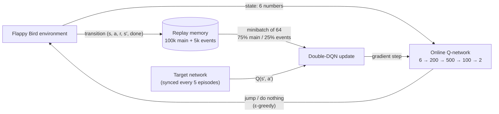

# Flappy Bird DQN


A Flappy Bird clone written from scratch, and a **Double Deep Q-Network (DQN)**
agent that teaches itself to play it. Nobody gives the agent instructions or
example games. It starts out flapping at random and learns from trial and
error to clear six levels of increasing difficulty, from a wide warm-up gap
to openings less than six bird-heights tall.

<!-- Add a demo GIF of the trained agent here, e.g.:
<p align="center"></p>
-->

---

## Contents

- [Highlights](#highlights)
- [How it works](#how-it-works)
  - [Reinforcement learning in 30 seconds](#reinforcement-learning-in-30-seconds)
  - [From Q-learning to Deep Q-Networks](#from-q-learning-to-deep-q-networks)
  - [What the agent sees, does and is rewarded for](#what-the-agent-sees-does-and-is-rewarded-for)
  - [Training loop](#training-loop)
  - [Project-specific techniques](#project-specific-techniques)
- [Levels](#levels)
- [Getting started](#getting-started)
- [Training outputs](#training-outputs)
- [Hyperparameters](#hyperparameters)
- [Project structure](#project-structure)

---

## Highlights

- **Custom game environment.** The physics, pipe generation, collision
  detection and pygame rendering are all written by hand. A synthetic clock
  lets training run headless, as fast as the CPU allows.
- **Double DQN in PyTorch**, with experience replay, a target network and
  ε-greedy exploration.
- **Dual replay buffer.** Deaths and pipe-clears go into a separate buffer
  so the agent doesn't forget them.
- **Gap-aware reward shaping.** The agent is rewarded for staying centred in
  the gap, and the tolerance scales with how big the gap is.
- **Adaptive curriculum.** When training on all levels, the agent practises
  its weakest levels more often.
- **Evaluation-gated checkpoints.** The saved model is only replaced when
  greedy test runs show it has improved on its worst level.
- **Live training dashboard.** A matplotlib window and CSV logs track
  progress in real time.

---

## How it works

### Reinforcement learning in 30 seconds

Reinforcement learning (RL) trains an **agent** by letting it interact with
an **environment**:

1. The agent observes the current **state** (where the bird is and where
   the pipes are).
2. It chooses an **action** (flap or do nothing).
3. The environment moves forward and returns a **reward**: positive for good
   outcomes such as clearing a pipe, negative for bad ones such as crashing.

Nobody labels the right move. The agent has to work out which actions lead
to the most total reward over time, including rewards that only arrive
several seconds after the decision that earned them.

### From Q-learning to Deep Q-Networks

**Q-learning** tries to learn a function `Q(state, action)`. It answers one
question: *"If I take this action now and play well afterwards, how much
total reward should I expect?"* With a good Q-function, playing is easy:
compute Q for both actions and pick the bigger one.

Q is learned from the **Bellman equation**, which says that the value of an
action equals the reward it gives right now plus the (discounted) value of
the best action from wherever you end up:

```
Q(s, a)  ≈  r  +  γ · max Q(s′, a′)
```

`γ = 0.99` is the discount factor. A reward one step in the future is worth
99% of the same reward now, which keeps the agent focused on the near future
without ignoring long-term consequences.

Classic Q-learning stores Q in a lookup table, but the bird's position and
velocity are continuous, so the table would be infinite. A **Deep Q-Network**
replaces the table with a neural network. Here it takes in 6 numbers that
describe the state and outputs 2 numbers, one Q-value per action.

A plain neural network trained this way is notoriously unstable. Standard
DQN adds three things to fix that, and this project uses all three:

| Technique | Problem it solves | How it works here |
|---|---|---|
| **Experience replay** | Consecutive frames are almost identical, and training on them in order causes the network to overfit to whatever just happened. | Every transition `(state, action, reward, next state, done)` is stored. Training samples random minibatches of 64 from that memory. |
| **Target network** | If the network computes its own training targets, every update moves the goal posts. | A second, frozen copy of the network computes the targets. It is synced with the main network every 5 episodes. |
| **Double DQN** | Taking the `max` over noisy Q estimates systematically overestimates values. | The main network *chooses* the next action and the target network *scores* it ([van Hasselt et al., 2015](https://arxiv.org/abs/1509.06461)). |

Exploration uses **ε-greedy**. With probability ε the agent takes a random
action, and otherwise it takes the action with the highest Q-value. ε starts
at 1.0 (fully random) and decays to 0.02 over training. A single flap
outweighs about 16 frames of gravity, so random actions are biased 95/5
towards *do nothing*. Without that bias, random exploration would just
launch the bird off the top of the screen.

### What the agent sees, does and is rewarded for

**State: 6 numbers, all scaled to roughly [-1, 1]**

| # | Feature | Meaning |
|---|---|---|
| 0 | `bird_y / screen_h` | Altitude of the bird |
| 1 | `velocity / 10` (clipped) | Rising or falling, and how fast |
| 2 | `(next_pipe_x − bird_x) / screen_w` | Distance to the next pipe (1.0 = no pipe yet) |
| 3 | `(bird_centre − gap_centre₁) / screen_h` | Offset from the centre of the next gap |
| 4 | `(bird_centre − gap_centre₂) / screen_h` | Offset from the centre of the gap after that |
| 5 | `gap_height / screen_h` | Size of the next gap (≈ 0.28 – 0.50) |

The last feature tells the network which level it's playing. A wide gap
means any reasonable altitude is safe, while a tight gap needs precise
centring. With that information a single network can learn the right
behaviour for every level.

**Actions:** `jump` or `do_nothing`. The agent makes a decision every 2
frames, which is 15 decisions per second at 30 fps.

**Rewards**

| Event | Reward |
|---|---|
| Fly off the top or bottom of the screen | **−10** (episode ends) |
| Hit a pipe | **−5** (episode ends) |
| Each step survived | +0.04 |
| Clear a pipe | **+5** |
| Stay centred in the next gap | up to +1, a Gaussian bonus whose width scales with the gap size |
| Line up with the following gap while approaching and passing the current pipe | up to +0.5 |

An episode ends when the bird crashes or clears 10 pipes.

### Training loop



The Q-network is a multilayer perceptron with three hidden layers
(200 → 500 → 100, ReLU) and a bias-free output layer, trained with Adam
(learning rate 3e-4). It takes one gradient step every 4 agent decisions,
after an initial warm-up of 5,000 decisions spent filling the replay memory.
Loss is computed only on the action that was actually taken, and Bellman
targets are clipped to [−20, 100] so a single outlier can't destabilise
training.

### Project-specific techniques

These go beyond textbook DQN and target specific problems in this game:

- **Event replay buffer.** Once the agent is decent, most frames are
  uneventful flying, and the rare crashes get pushed out of a normal replay
  buffer. The agent then "forgets" what killed it and gets worse, a problem
  known as catastrophic forgetting. To prevent this, deaths and pipe-clears
  are also copied into a separate 5,000-entry buffer, and every minibatch
  draws 25% of its samples from it. This is a lightweight alternative to
  prioritised experience replay.
- **Gap-aware Gaussian centring reward.** The centring bonus has the form
  `exp(−k · offset²)` with `k ∝ 1 / gap_size²`. On wide gaps the curve is
  broad, so being roughly centred is enough. On tight gaps it is sharp, so
  only precise centring is rewarded.
- **Adaptive curriculum (`--genTrain`).** Each episode picks a level at
  random, weighted by `max(0.5, 10 − recent average score)`. Levels the agent
  struggles with come up more often, and mastered levels still appear
  occasionally so they aren't forgotten.
- **Evaluation-gated checkpoints.** Every 1,000 training episodes, training
  pauses for 30 purely greedy episodes per level (no random exploration).
  `sec_model.ckpt` is overwritten only if the agent's **worst** level
  improves, so a lucky streak on an easy level can't replace a better
  all-round model.

---

## Levels

Difficulty increases along a single axis: the gap gets smaller and moves
further up and down between pipes. Everything else is identical across
levels, so one policy can in principle be optimal on all of them.

| Level | Gap height | Vertical drift | Notes |
|:---:|:---:|:---:|---|
| 1 | 300 px | ±60 px  | Warm-up: wide gap that barely moves |
| 2 | 260 px | ±90 px  | |
| 3 | 230 px | ±110 px | |
| 4 | 210 px | ±130 px | |
| 5 | 190 px | ±150 px | |
| 6 | 170 px | ±170 px | Tightest: under 6 bird-heights, full vertical range |

All levels share a 400 × 600 screen at 30 fps, 60 px-wide pipes spawning
every 1.8 s, and 10 pipes per episode. Physics, colours and level
definitions all live in [`config.yml`](config.yml).

---

## Getting started

### Requirements

- Python 3.10+
- numpy, PyTorch, pygame (or [pygame-ce](https://pyga.me/)), gymnasium,
  PyYAML, colorama and matplotlib. matplotlib is optional and only powers
  the live dashboard.

### Install

```bash
git clone https://github.com/MatinHabi/FlappyBirdAIGame.git
cd FlappyBirdAIGame

python -m venv .venv
source .venv/bin/activate        # Windows: .venv\Scripts\activate
pip install -r requirements.txt
```

> `requirements.txt` installs **pygame-ce**, a maintained drop-in
> replacement for pygame. The original `pygame` package has no working
> build for Python 3.14 yet. On Python 3.13 or older, the original works
> too. Don't install both in the same environment.

### Train

Train one agent on all six levels with the adaptive curriculum, the live
dashboard and CSV logging:

```bash
python sec_model.py --genTrain --csv
```

Train on a single level:

```bash
python sec_model.py --level 5 --csv
```

Resume training from a saved checkpoint:

```bash
python sec_model.py --genTrain --load sec_model_running.ckpt
```

Training runs headless by default. Add `--watch` to render every episode,
which is much slower but fun to look at.

### Watch the agent play

Once training has produced `sec_model.ckpt`:

```bash
python sec_model.py --eval --level 6 --episodes 10
```

This opens a game window, plays the requested number of episodes with the
greedy policy, and prints the max and mean score.

### Command-line options

| Flag | Default | Description |
|---|---|---|
| `--genTrain` | off | Train on all six levels with the adaptive curriculum (70,000 episodes). Without it, trains on `--level` only (50,000 episodes). |
| `--level N` | `1` | Level (1–6) for single-level training or `--eval`. |
| `--csv` | off | Log metrics to CSV and open the live dashboard. |
| `--watch` | off | Render the game while training. |
| `--load PATH` | — | Resume training from a checkpoint (ε restarts at 0.1). |
| `--eval` | off | Skip training and watch a saved model play. |
| `--model-path PATH` | `sec_model.ckpt` | Checkpoint used by `--eval`. |
| `--episodes N` | `10` | Number of episodes for `--eval`. |

---

## Training outputs

| File | Contents |
|---|---|
| `sec_model.ckpt` | Best model according to the periodic greedy evaluation. This is the one to use. |
| `sec_model_running.ckpt` | Best model according to rolling training scores. Handy for `--load`. |
| `fun_train.csv` | One row per training episode: level, score, ε, per-level and overall rolling averages (with `--csv`). |
| `fun_eval.csv` | One row per evaluation: greedy mean score per level and whether a new checkpoint was saved (with `--csv`). |

With `--csv`, the **live dashboard** refreshes every 50 episodes with four
panels:

1. Per-level rolling average score
2. Exploration rate ε
3. Overall running average
4. Worst-level evaluation score, with a ★ marking each saved checkpoint

When training finishes, the dashboard stays open until you close it.

---

## Hyperparameters

| Parameter | Value |
|---|---|
| Network | 6 → 200 → 500 → 100 → 2 (ReLU, bias-free output) |
| Optimiser | Adam, learning rate 3e-4 |
| Discount factor γ | 0.99 |
| Minibatch size | 64 (75% main buffer / 25% event buffer) |
| Replay memory | 100,000 transitions (main) + 5,000 (events) |
| Warm-up before training | 5,000 agent decisions |
| Train frequency | 1 gradient step every 4 decisions |
| Target network sync | every 5 episodes |
| ε schedule | 1.0 → 0.02, ×0.9999 per episode (all levels) / ×0.9995 (single level) |
| Bellman target clip | [−20, 100] |
| Evaluation | every 1,000 episodes, 30 greedy episodes per level |

---

## Project structure

```
.
├── sec_model.py        # DQN agent (state, reward, replay, Double-DQN update) + training / eval CLI
├── mlp_regressor.py    # PyTorch Q-network with a masked-MSE training step
├── flappy_env.py       # Flappy Bird environment: physics, pipes, collisions, rendering
├── flappy_clock.py     # Real-time clock for rendering, synthetic clock for headless training
├── config.yml          # Screen, physics, colours and the six level definitions
├── make_bird_image.py  # Optional: generates a simple placeholder bird sprite
├── bird.png            # Bird sprite used when rendering
└── requirements.txt
```
